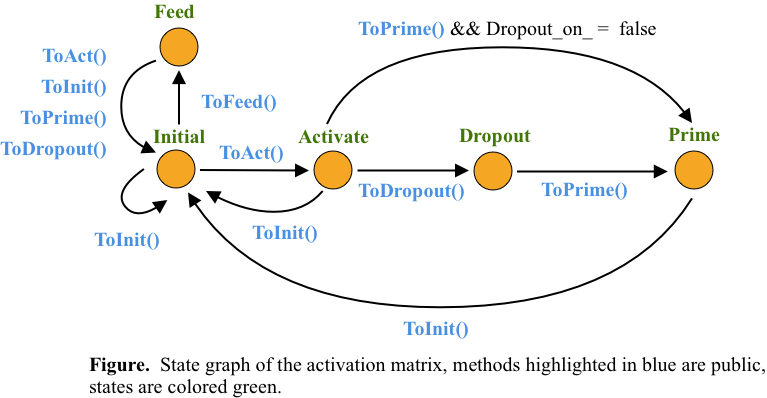

# Development Tutorial
This file explains the IntellGraph architectures and includes development techniques used in the project. For potential contributors, it is highly recommended. Note the IntellGraph project is still far away from mature
(though users are able to use it building deep neural networks and run examples such as [MNIST](http://yann.lecun.com/exdb/mnist/index.html), see mnist_classifier.h from the examples directory). Therefore, it is expected to modified and updated frequently and contributors who were confidently familiar with the material should bear this in mind.

## Node
In node classes, only one dynamic matrix (activation matrix) is used and it stores data for activation, prime value of activation and input features (if it is an input node). To avoid unexpected data loss and in order to give a clear view of state transitions of the activation matrix, The [State Pattern](https://en.wikipedia.org/wiki/State_pattern) is implemented (see the figure below).

